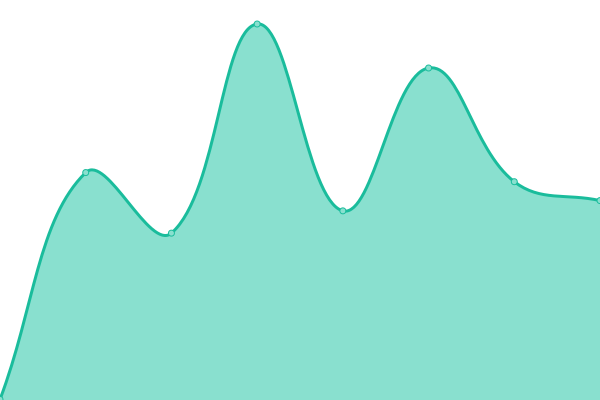
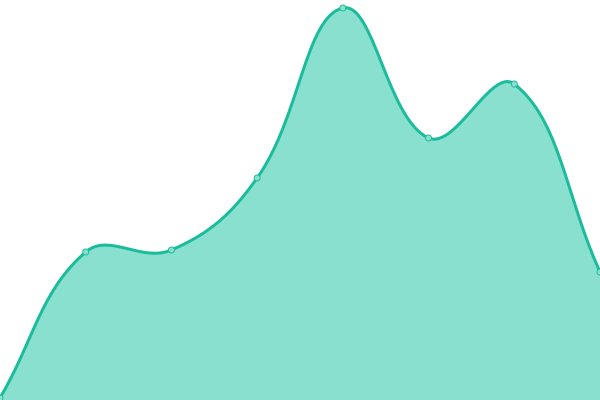

# [📈 Live Status](https://upptime.daizixi.space): <!--live status--> **🟧 部分停机**

This repository contains the open-source uptime monitor and status page for [dai zixi](https://upptime.daizixi.space), powered by [Upptime](https://github.com/upptime/upptime).

With [Upptime](https://upptime.js.org), you can get your own unlimited and free uptime monitor and status page, powered entirely by a GitHub repository. We use [Issues](https://github.com/griedzx/Upptime/issues) as incident reports, [Actions](https://github.com/griedzx/Upptime/actions) as uptime monitors, and [Pages](https://upptime.daizixi.space) for the status page.

<!--start: status pages-->
<!-- This summary is generated by Upptime (https://github.com/upptime/upptime) -->
<!-- Do not edit this manually, your changes will be overwritten -->
<!-- prettier-ignore -->
| 链接 | 状态 | 历史 | 响应时间 | 正常运行时间 |
| --- | ------ | ------- | ------------- | ------ |
|  [Alist](https://alist.daizixi.space) | 🟥 停机 | [alist.yml](https://github.com/griedzx/Upptime/commits/HEAD/history/alist.yml) | 

 0毫秒
     
 | 

<a href="https://upptime.daizixi.space/history/alist">0.00%</a>
    

|  [memos](https://memos.daizixi.space) | 🟥 停机 | [memos.yml](https://github.com/griedzx/Upptime/commits/HEAD/history/memos.yml) | 

 0毫秒
     
 | 

<a href="https://upptime.daizixi.space/history/memos">0.00%</a>
    

|  [vault](https://vault.daizixi.space) | 🟥 停机 | [vault.yml](https://github.com/griedzx/Upptime/commits/HEAD/history/vault.yml) | 

 0毫秒
     
 | 

<a href="https://upptime.daizixi.space/history/vault">0.00%</a>
    

|  [nginx proxy manager](https://npm.daizixi.space) | 🟥 停机 | [nginx-proxy-manager.yml](https://github.com/griedzx/Upptime/commits/HEAD/history/nginx-proxy-manager.yml) | 

 0毫秒
     
 | 

<a href="https://upptime.daizixi.space/history/nginx-proxy-manager">0.00%</a>
    

|  [upptime](https://upptime.daizixi.space) | 🟥 停机 | [upptime.yml](https://github.com/griedzx/Upptime/commits/HEAD/history/upptime.yml) | 

 0毫秒
     
 | 

<a href="https://upptime.daizixi.space/history/upptime">0.00%</a>
    

|  [blog](https://griedzx.github.io) | 🟩 正常运行 | [blog.yml](https://github.com/griedzx/Upptime/commits/HEAD/history/blog.yml) | 

 104毫秒
     
 | 

<a href="https://upptime.daizixi.space/history/blog">100.00%</a>
    

<!--end: status pages-->

[**Visit our status website →**](https://upptime.daizixi.space)

## 📄 License

- Powered by: [Upptime](https://github.com/upptime/upptime)
- Code: [MIT](./LICENSE) © [Anand Chowdhary](https://anandchowdhary.com), supported by [Pabio](https://pabio.com)
- Data in the `./history` directory: [Open Database License](https://opendatacommons.org/licenses/odbl/1-0/)
